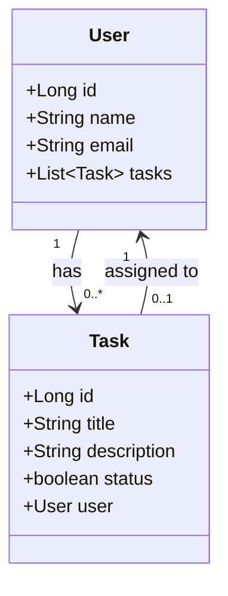
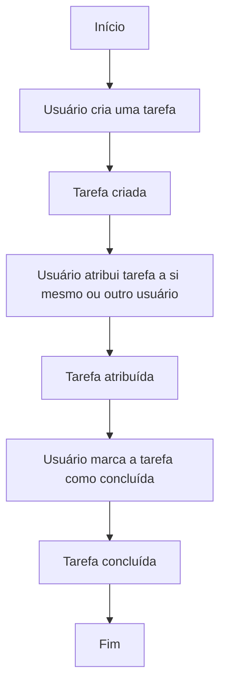

# Gerenciador de Tarefas
Criado para o Bootcamp da Avanade

## Descrição

"API de gerenciamento de tarefas: o usuário pode se registrar, 
fazer login e adicionar tarefas à sua lista. Além disso, é 
possível alterar o status das tarefas para 'Em Progresso', 
'A Fazer' ou 'Concluída', bem como deletá-las conforme 
necessário.

## Entidades

## Fluxograma

